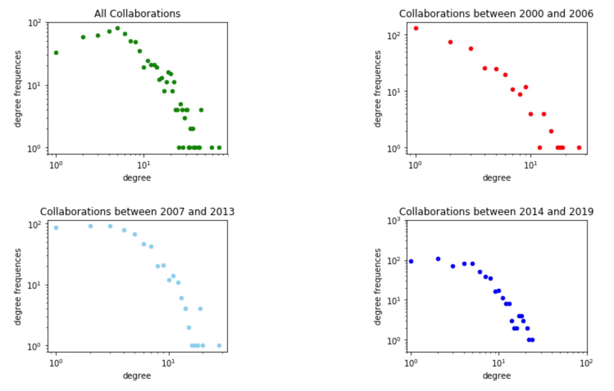
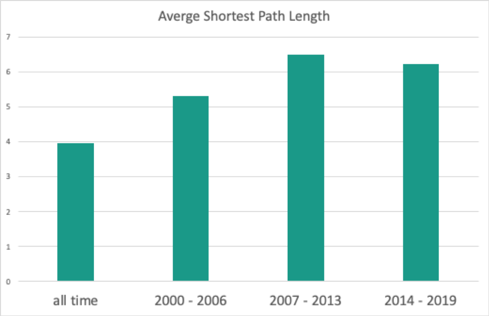
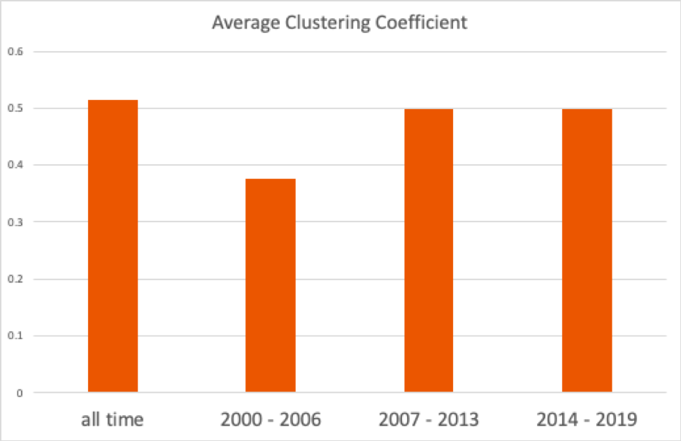

# Collaboration-network-construction-and-analysis
This project was aimed to construct WashU engineering collaboration network by crawling data from google Scholar, and then made network analysis based on clustering algorithms.
## Web crawler
**dep.txt** is our original data, which includes all WashU engineering professors' Google Scholar links.  

Given file of links you intend to crawl (has to be only links with the exact format as the **dep.txt** file),this crawler will extract the following informations: Researcher names, fileds (if available, otherwise writes N/A), co-authors (if available, otherwise writes N/A), publications with years (if available, otherwise writes N/A; and max 1000). The crawler will also go over the co-authors (max at 20) of the provided links but will not go any further.  

With dep.txt as input file, we got the raw data **output/publications.tsv**. And the final results are **output/nodes1.tsv** and **output/edges.tsv**. If you wish to use your own links and get the final results as shown in these two files, you should run the java files in the following orders:

**./src/main/java/WebCrawlerEngineering.java**, which crawls all the data using the logic above It will generate two files: output/domain.tsv and output/publications.tsv as the raw data;  

**./src/main/java/NodeConstructor.java** It will use the previous output files to constrcut the **output/node.tsv**. Optional inputs: if you have additional informaitons, e.g. affiliation of each nodes, provides the links as the inputs. The examples we provided here are: **output/affiliation/ce_dep.txt**, **output/affiliation/bme_dep.txt**, **output/affiliation/mems_dep.txt**, **output/affiliation/ese_dep.txt**, **output/affiliation/ece_dep.txt**;  

**./src/main/java/EdgeConstructor.java** It will read the **node.tsv** file and generate the final outputs: **output/nodes1.tsv** and **output/edges.tsv**. 

## Network description 
With visualization tool **Gephi**, we got whole network graph and in-washu collobration network as below:
Running the **Data Processing.ipyn** file, we constructed the collaboration networks during the year 2000-2006, 2007-2013, and 2014-present and these files were stored in the folder output/collabration_year. And some basic statistics comparisons are shown as below:

## Community Detection
We mainly used two methods, spectral and modularity maximization clustering algorithms, to cluster the network we have built. And then we compared these two clustering algorithms with 
1.

 
